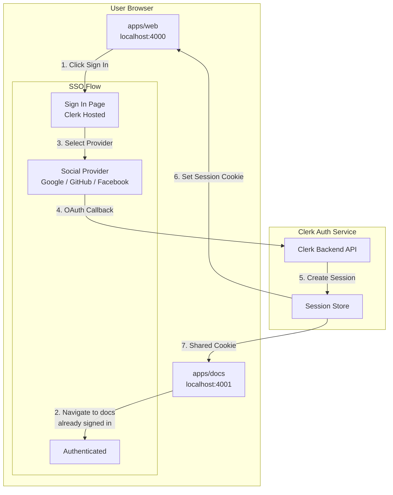
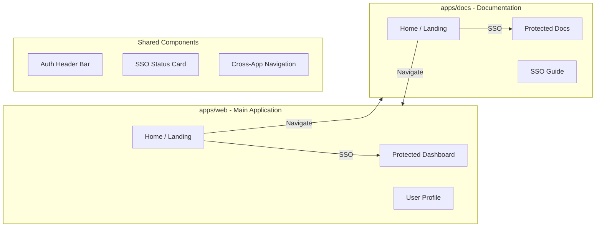
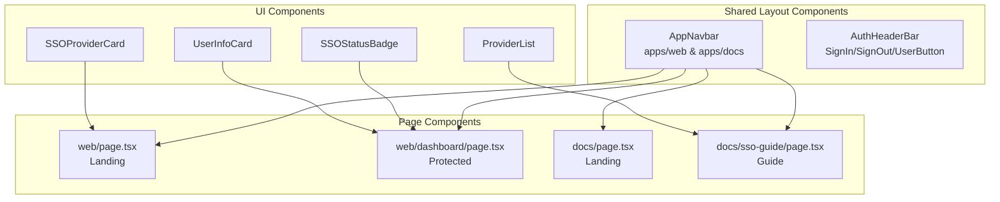

# SSO Showcase UI Flow Plan

## Project Overview

**Objective**: Create a proper UI flow to demonstrate Single Sign-On (SSO) using two Next.js applications in a Turborepo monorepo, with Clerk as the authentication provider.

**Architecture Summary**:
- **apps/web** - Main web application (runs on port 4000)
- **apps/docs** - Documentation application (runs on port 4001)
- Both apps share the same Clerk instance for true SSO across applications

---

## Current State Assessment

### Existing Infrastructure
- Turborepo monorepo with two Next.js 16 apps
- Clerk authentication v7.0.1 configured in both apps
- Basic proxy.ts middleware with `clerkMiddleware()`
- Shared UI package (`@repo/ui`) with Button, Card, Code components
- Basic layout with ClerkProvider, SignInButton, SignUpButton, UserButton

### Gap Analysis
- Pages are generic Next.js starter templates, not SSO-focused
- No protected dashboard or user profile pages
- No visual demonstration of SSO cross-app behavior
- Missing SSO provider showcase section
- No cross-app navigation to demonstrate SSO

---

## UI Flow Architecture

### Mermaid Diagram: SSO Authentication Flow



### Mermaid Diagram: Application Structure



---

## Implementation Plan

### Phase 1: Environment & Configuration

#### Step 1.1: Verify Clerk Configuration
- [ ] Ensure `.env.local` has valid Clerk keys
- [ ] Configure Clerk sign-in/sign-up URLs
- [ ] Set up after-sign-in and after-sign-up redirects
- [ ] Configure both apps to use same Clerk instance

```typescript
// apps/web/app/layout.tsx - Enhanced ClerkProvider
<ClerkProvider
  signInUrl="/sign-in"
  signUpUrl="/sign-up"
  afterSignInUrl="/dashboard"
  afterSignUpUrl="/dashboard"
>
```

#### Step 1.2: Update Proxy Configuration
- [ ] Ensure middleware matches both apps
- [ ] Configure public routes appropriately
- [ ] Set up route protection patterns

### Phase 2: Shared UI Components

#### Step 2.1: Create SSO Status Component
Location: `packages/ui/src/sso-status.tsx`

```typescript
interface SSOStatusProps {
  isAuthenticated: boolean;
  user?: {
    name: string;
    email: string;
    image?: string;
  };
  ssoProvider?: string;
}
```

Features:
- Display authentication state
- Show connected SSO provider
- Display user avatar and info
- Visual badge for SSO method used

#### Step 2.2: Create Navigation Component
Location: `packages/ui/src/app-navbar.tsx`

Features:
- Logo/App name
- Cross-app navigation links
- Auth status indicator
- Sign In/Sign Out buttons

#### Step 2.3: Create SSO Provider Cards
Location: `packages/ui/src/sso-provider-card.tsx`

```typescript
interface SSOProviderProps {
  provider: 'google' | 'github' | 'facebook' | 'twitter';
  description: string;
  icon: string;
}
```

Features:
- Provider logo/icon
- Provider name
- Brief description
- Hover effects

### Phase 3: App Web Implementation

#### Step 3.1: Landing Page (`apps/web/app/page.tsx`)
- Hero section with SSO explanation
- SSO provider showcase (Google, GitHub, Facebook icons)
- Call-to-action buttons
- Cross-app navigation to docs

#### Step 3.2: Protected Dashboard (`apps/web/app/dashboard/page.tsx`)
- Welcome message with user name
- Authentication details
- SSO provider used
- Session information
- Quick links to docs app

#### Step 3.3: User Profile (`apps/web/app/profile/page.tsx`)
- User information display
- Connected accounts
- Account settings link

### Phase 4: App Docs Implementation

#### Step 4.1: Landing Page (`apps/docs/app/page.tsx`)
- SSO documentation overview
- Quick start guide
- Links to web app
- SSO demonstration section

#### Step 4.2: Protected Documentation (`apps/docs/app/docs/page.tsx`)
- SSO integration guide
- Code examples
- Configuration reference

#### Step 4.3: SSO Guide (`apps/docs/app/sso-guide/page.tsx`)
- Step-by-step SSO setup
- Provider configuration
- Best practices

### Phase 5: Styling & UX Enhancements

#### Step 5.1: Global Styles Enhancement
- Enhanced color scheme for auth states
- Smooth transitions for auth changes
- Loading states for auth operations

#### Step 5.2: Visual Feedback
- Auth state transitions
- Loading spinners
- Toast notifications for auth events

#### Step 5.3: Responsive Design
- Mobile-friendly auth flows
- Touch-friendly buttons

---

## Page Specifications

### apps/web/app/page.tsx - Landing Page

```typescript
// Structure
- Header: AppNavbar with logo + auth status
- Hero: "SSO Demo - Two Apps, One Login"
- SSO Providers Section: Google, GitHub, Facebook cards
- Features: 
  - "Single Sign-On" - Sign in once, access both apps
  - "Secure Authentication" - Powered by Clerk
  - "Cross-App Navigation" - Seamless experience
- CTA: "Get Started" → Sign In
- Footer: Link to docs app
```

### apps/web/app/dashboard/page.tsx - Protected Dashboard

```typescript
// Structure
- Header: AppNavbar with user info
- Welcome: "Welcome back, {name}!"
- Auth Card:
  - User avatar
  - Email
  - SSO provider used
  - Session ID (truncated)
- Quick Actions:
  - "View Profile"
  - "Go to Docs"
  - "Sign Out"
```

### apps/docs/app/page.tsx - Docs Landing

```typescript
// Structure
- Header: AppNavbar with logo + auth status
- Hero: "SSO Documentation"
- Sections:
  - "What is SSO?" - Brief explanation
  - "Supported Providers" - List of providers
  - "Getting Started" - Quick links
- CTA: "Try the Demo" → Web app
- Footer: Link to web app
```

---

## Component Hierarchy



---

## Environment Variables Required

```bash
# Shared Clerk Configuration
NEXT_PUBLIC_CLERK_PUBLISHABLE_KEY=pk_test_...
CLERK_SECRET_KEY=sk_test_...

# App-specific (can be same or different)
NEXT_PUBLIC_CLERK_SIGN_IN_URL=/sign-in
NEXT_PUBLIC_CLERK_SIGN_UP_URL=/sign-up
NEXT_PUBLIC_CLERK_AFTER_SIGN_IN_URL=/dashboard
NEXT_PUBLIC_CLERK_AFTER_SIGN_UP_URL=/dashboard

# For cross-app SSO - use same domain pattern
NEXT_PUBLIC_APP_URL=http://localhost:4000
NEXT_PUBLIC_DOCS_URL=http://localhost:4001
```

---

## Success Criteria

1. **Authentication Flow**: User can sign in via any social SSO provider (Google, GitHub, Facebook)
2. **SSO Behavior**: Signing into one app automatically authenticates the other
3. **Visual Feedback**: Clear indication of authentication state on all pages
4. **Cross-App Navigation**: Seamless navigation between apps while maintaining session
5. **Protected Routes**: Dashboard and profile pages only accessible when authenticated
6. **Consistent UI**: Both apps share consistent styling and authentication components
7. **User Experience**: Intuitive flow from landing → sign in → dashboard

---

## File Changes Summary

### New Files to Create

| File | Purpose |
|------|---------|
| `packages/ui/src/sso-status.tsx` | SSO status badge component |
| `packages/ui/src/app-navbar.tsx` | Shared navigation component |
| `packages/ui/src/sso-provider-card.tsx` | Provider display cards |
| `packages/ui/src/user-info-card.tsx` | User information display |
| `apps/web/app/dashboard/page.tsx` | Protected dashboard |
| `apps/web/app/profile/page.tsx` | User profile page |
| `apps/docs/app/docs/page.tsx` | Protected docs section |
| `apps/docs/app/sso-guide/page.tsx` | SSO guide page |

### Files to Modify

| File | Changes |
|------|---------|
| `apps/web/app/layout.tsx` | Enhanced ClerkProvider config |
| `apps/web/app/page.tsx` | SSO-focused landing page |
| `apps/web/app/globals.css` | Additional auth-related styles |
| `apps/docs/app/layout.tsx` | Enhanced ClerkProvider config |
| `apps/docs/app/page.tsx` | SSO documentation landing |
| `apps/docs/app/globals.css` | Additional auth-related styles |
| `packages/ui/package.json` | Add icon dependencies |

---

## Next Steps

After approval of this plan, proceed with Phase 1 implementation:

1. Update ClerkProvider configuration in both apps
2. Create shared UI components
3. Build landing pages with SSO focus
4. Implement protected routes
5. Add cross-app navigation
6. Polish styling and animations
